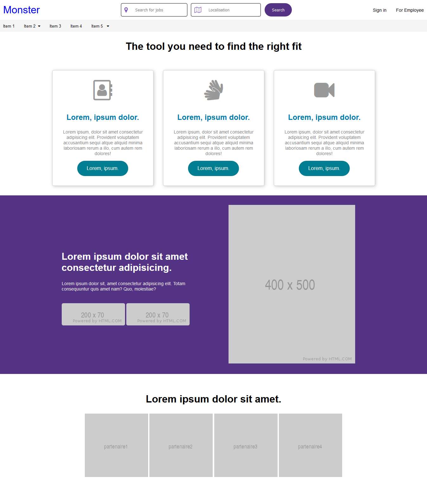

# titre de niveau 1

markdown ==> sous ensemble du html

## titre de niveau 2

le site internet de création de recette de cuisine contient les pages suivantes :

- page d'accueil
- page de contact
- page recette
- page mentions légales

autre liste :

1. s'être connecté au back office
2. disposer d'un profil gestionnaire
3. rédiger en français et en anglais

liste des future codage :

1. [x] réaliser la page connexion
2. [ ] créer la base de données
3. [ ] installer PHP

Lien hypertexte :

[lien vers google](https://google.fr)

## titre de niveau 3

Ajouter une image :



## Afficher des commandes

```
git add .
git commit -m "message"
git push
```
code dans un paragraphe `git commit`